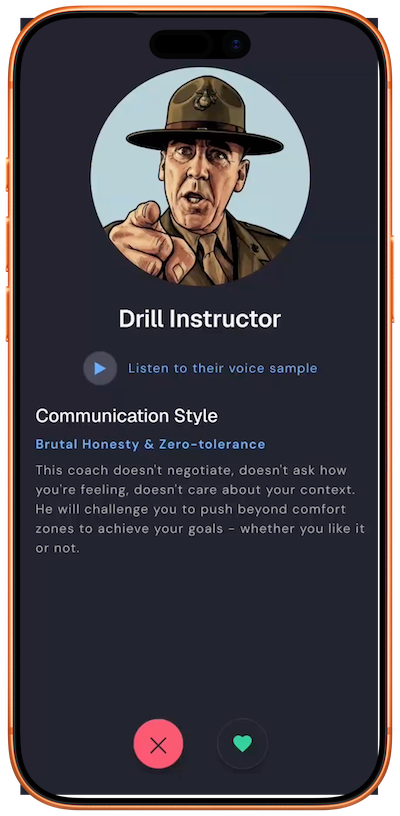

# Scare Tactics

A Tinder-style mobile app where you swipe through abrasive "accountability
coach" personas (Drill Instructor, Malcolm Tucker, Phil Stutz, Tiger Mom, and
more), match with one, and let them ride you about a goal you're too soft to
commit to on your own. 

## What it does

- **Swipe deck** — browse a stack of coach personas, each with their own
  voice, communication style, and (fake) voice sample.
- **Match & commit** — pick a coach, state a goal, set a deadline, and choose
  a daily notification window for check-ins.
- **Lock in the contract** — a final "sign here" screen before the coach
  starts holding you to it.
- **Camera check-ins** — a fake weigh-in flow: point the camera at a scale,
  a scanning overlay "reads" the display, and the coach reacts to the
  number.
- **Weight trend chart** — a Jul–Dec chart of check-ins with a projected
  trend line, styled per coach.

## Demo

<p align="center">
  
</p>

## Tech stack

- **[Expo](https://expo.dev) SDK 57** (managed workflow) on **React Native
  0.86** / **React 19**
- **TypeScript**, strict mode
- **[Expo Router](https://docs.expo.dev/router/introduction/)** — file-based
  navigation (`app/`)
- **[Zustand](https://github.com/pmndrs/zustand)** — app/session state
- **[react-native-reanimated](https://docs.swmansion.com/react-native-reanimated/)**
  - **[react-native-gesture-handler](https://docs.swmansion.com/react-native-gesture-handler/)**
    — the swipeable card deck, camera/scan transitions
- **[react-native-svg](https://github.com/software-mansion/react-native-svg)**
  — the weight trend charts
- **[expo-camera](https://docs.expo.dev/versions/latest/sdk/camera/)** /
  **[expo-audio](https://docs.expo.dev/versions/latest/sdk/audio/)** — check-in
  camera flow and persona voice samples
- **[react-native-calendars-datepicker](https://www.npmjs.com/package/react-native-calendars-datepicker)**
  — deadline picker
- **ESLint** (`eslint-config-expo`)

**Assets:** persona avatar artwork generated with **Google Gemini** and
edited/composited in **Affinity**.

- **[Figma Design System](https://www.figma.com/design/bC6WsiTTPWeeaMuMqmIeYe/Scare-Tactics?node-id=506-874)**


## Running it locally

### Prerequisites

- [Node.js](https://nodejs.org/)
- The [Expo Go](https://expo.dev/go) app on a physical device, **or**
  - Xcode + iOS Simulator (macOS only), and/or
  - Android Studio + an Android emulator

### Install & start

```bash
npm install
npx expo start
```

This opens the Metro bundler. From there:

- Press `i` to launch in the iOS Simulator
- Press `a` to launch in an Android emulator
- Scan the QR code with the Expo Go app on a physical device

Or launch straight into a simulator:

```bash
npm run ios       # iOS Simulator
npm run android   # Android emulator
```

### Other scripts

```bash
npm run lint       # expo lint
npx tsc --noEmit   # typecheck
```

## Project structure

```
app/          Screens (Expo Router file-based routes)
components/   Reusable UI components, one per file
hooks/        Shared hooks (gestures, theme, layout CTA, etc.)
store/        Zustand stores (session, goal state)
data/         Static persona/content data
constants/    Design tokens (colour, spacing, typography)
types/        Shared TypeScript types
utils/        Small pure helpers
```

See [`CLAUDE.md`](CLAUDE.md) for the fuller set of conventions this repo
follows.
